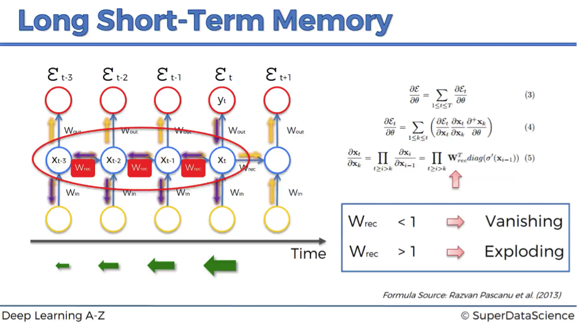

# <strong>Image Captioning using Tensorflow</strong>

### CNN-LSTM Architecture based Image Caption Generator using PreTrained VGG16 model.

### [Deployement Link](https://xs-urlshortener.herokuapp.com)

## Overview
Recurrent Neural Networks (RNN) are used for varied number of applications including machine translation. The Encoder-Decoder architecture is utilized for such settings where a varied-length input sequence is mapped to the varied-length output sequence. The same network can also be used for image captioning.

In image captioning, the core idea is to use CNN as encoder and a normal RNN as decoder. This application uses the architecture proposed by Show and Tell: A Neural Image Caption Generator.

## Implementation
This Image caption generator is developed using Tensorflow and Streamlit.
* Frontend Application - <strong>Streamlit</strong>
* Dataset Used - <strong>Flickr8k Dataset</strong>
* PreTrained Model- <strong>VGG16</strong>
* Encoder- <strong>Convolutional Neural Network</strong>
* Encoder- <strong>Long Short Term Memory</strong>

### Project Status
* Image Captioning-✅
* Frontend Application- 🚧

